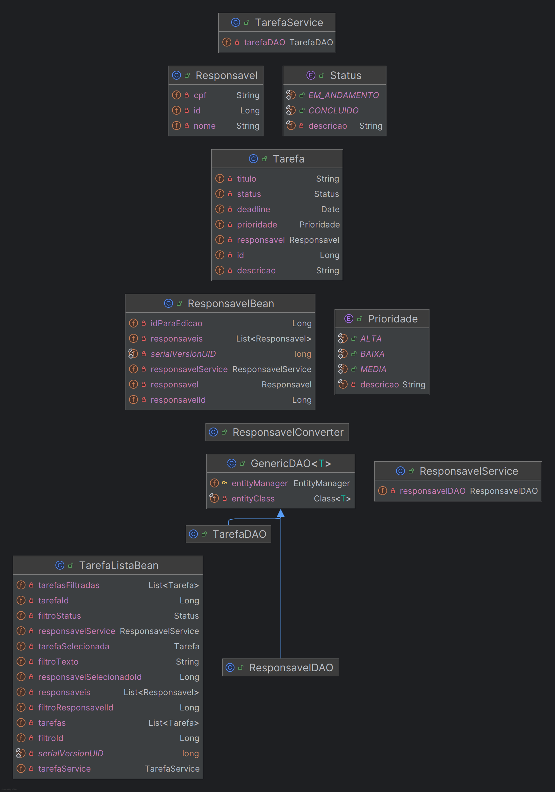

# Sistema de Gestão de Tarefas

## 📋 Sobre o Projeto

Sistema web para gerenciamento de tarefas desenvolvido em Java utilizando JSF (JavaServer Faces) e Hibernate. A aplicação permite criar, editar, listar e excluir tarefas, além de gerenciar responsáveis pelas mesmas.

## 🏗️ Arquitetura e Estrutura

### Tecnologias Utilizadas
- **Java 11+** - Linguagem de programação
- **JSF 2.3** - Framework web para interface do usuário  
- **PrimeFaces 7.0** - Biblioteca de componentes JSF
- **Hibernate 4.3** - Framework ORM para persistência
- **PostgreSQL** - Banco de dados relacional
- **Maven** - Gerenciador de dependências
- **Apache Tomcat 9** - Servidor de aplicação

### Estrutura de Pastas

```
src/main/java/projeto_estagio/gestaoDeTarefas/
├── controller/     # Managed Beans (Controladores JSF)
├── converter/      # Conversores JSF
├── dao/           # Data Access Objects (Acesso aos dados)
├── enums/         # Enumerações (Status, Prioridade)
├── model/         # Entidades JPA (Tarefa, Responsavel)
└── service/       # Camada de serviços (Regras de negócio)

src/main/webapp/
├── *.xhtml        # Páginas JSF (Facelets)
└── WEB-INF/       # Configurações web (web.xml, faces-config.xml)

src/main/resources/
└── META-INF/
    └── persistence.xml  # Configuração JPA/Hibernate
```

## 📊 Entidades do Sistema



## 🎯 Funcionalidades

Foram desenvolvidos os requisitos:

a) Criar uma aplicação Java Web utilizando JavaServer Faces (JSF)

b) Utilizar persistência em um banco de dados PostgreSQL.

c) Utilizar JPA

### Gestão de Tarefas
- ✅ Criar nova tarefa
- ✅ Editar tarefa existente
- ✅ Listar todas as tarefas
- ✅ Filtrar por: Número, Título/Descrição, Responsável, Situação
- ✅ Concluir tarefa
- ✅ Excluir tarefa

### Gestão de Responsáveis
- ✅ Cadastrar responsável
- ✅ Editar responsável
- ✅ Listar responsáveis
- ✅ Excluir responsável

## 🚀 Requisitos para Execução

### Pré-requisitos

#### 1. Apache Tomcat 9
- Download: [https://tomcat.apache.org](https://tomcat.apache.org)

#### 2. Docker
- Download: [https://www.docker.com/products/docker-desktop](https://www.docker.com/products/docker-desktop)
- Instalar e inicializar o Docker Desktop

#### 3. IDE (IntelliJ IDEA recomendado)
- IntelliJ IDEA Ultimate
- Alternativas: Eclipse, VS Code

## 🐳 Configuração do Banco PostgreSQL com Docker

### 1. Criar e executar container PostgreSQL:
```bash
docker run --name postgres-gestao-tarefas \
  -e POSTGRES_DB=gestao-de-tarefas \
  -e POSTGRES_USER=admin \
  -e POSTGRES_PASSWORD=admin \
  -p 5432:5432 \
  -d postgres:16
```

### 2. Verificar se o container está rodando:
```bash
docker ps
```

## ⚙️ Configuração e Execução do Projeto

### 1. Clonar/Baixar o projeto
```bash
git clone https://github.com/nnicolly/gestao-de-tarefas.git
```

### 2. Importar na IDE
- Abrir Projeto na sua IDE de preferência

### 3. Configurar Tomcat na IDE

#### IntelliJ IDEA:
1. Run → Edit Configurations
2. Add New Configuration → Tomcat Server → Local
3. Configure Tomcat Home
4. Deployment → Add Artifact → `gestaoDeTarefas:war exploded`
5. Application context: `/`

### 4. Executar a aplicação
1. Garantir que o Docker PostgreSQL está rodando
2. Executar o Tomcat pela IDE
3. Acessar: [http://localhost:8080/](http://localhost:8080/)

## 🔧 Configurações Importantes

### Banco de Dados (persistence.xml)
```xml
<property name="javax.persistence.jdbc.url" value="jdbc:postgresql://localhost:5432/gestao-de-tarefas"/>
<property name="javax.persistence.jdbc.user" value="admin"/>
<property name="javax.persistence.jdbc.password" value="admin"/>
```

## 📱 Como Usar

1. **Tela Inicial:** Menu principal com acesso às funcionalidades
2. **Gerenciar Tarefas:** Criar, listar, filtrar e editar tarefas
3. **Gerenciar Responsáveis:** Cadastrar e gerenciar responsáveis
4. **Filtros:** Pesquisar tarefas por ID, título, responsável ou status

---

*Projeto desenvolvido para teste técnico para estágio na ESIG Software* ☕